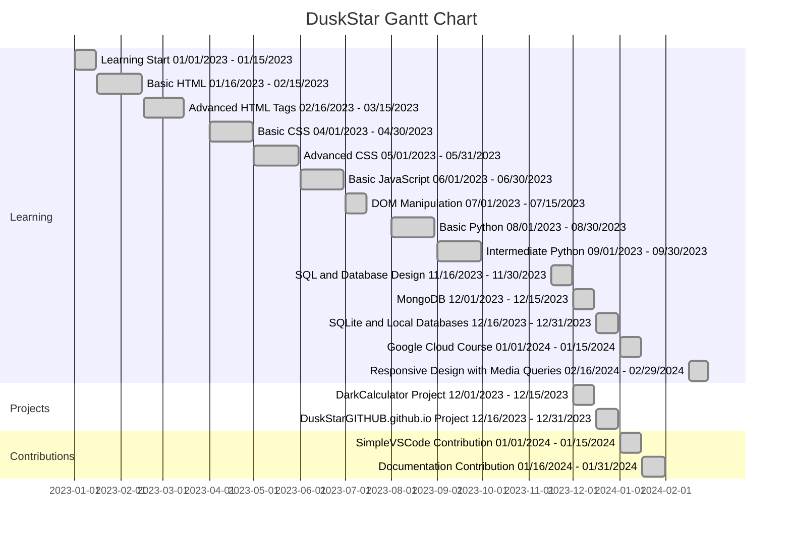

<!--YOU HERE?-->

<!--Banner-->
<picture>
	
</picture>

<!--Seccion-->
<h2><picture></picture><br>&nbsp;&nbsp;STATS</h2>
<div align="center">
	
	
</div>

<!--Seccion-->
<h2><picture></picture><br>&nbsp;&nbsp;MORE...</h2>

<!--Desglozar-->
<details>
	<summary>
		🧠 Skills
	</summary>
<div align="center">
	<!--Tabla-->
	<table>
		<tr>
			<td>Front End</td>
			<td>Backend</td>
    			<td>BD</td>
    			<td>Dev</td>
    			<td>Dev Ops</td>
    			<td>Tools</td>
  		</tr>
		<tr>
			<td>
				
				
			</td>
			<td>
				
				
			</td>
			<td>
				
				
			</td>
			<td>
				
			</td>
			<td>
				
				
			</td>
			<td>
				
				
			</td>
		</tr>
		<tr>
			<td></td>
			<td>
				
				
			</td>
			<td>
				
			</td>
			<td>
				
				
			</td>
			<td>
				
				
			</td>
			<td>
				
				
			</td>
		</tr>
		<tr>
			<td></td>
			<td></td>
			<td></td>
			<td>
				
				
			</td>
			<td></td>
			<td></td>
		</tr>
		<tr>
			<td></td>
			<td></td>
			<td></td>
			<td>
				
				
			</td>
			<td></td>
			<td></td>
		</tr>
	</table>
</div>
</details>
	
<!--Desglozar-->
<details>
	<summary>
		🎓 Career Journey
	</summary>
	<div align="center">
	


---

</div>
</details>

<!--Desglozar-->
<details>
	<summary>
		🚀 Projects
	</summary>
	<br>
	<table align="center">
		<thead align="center">
			<tr border: none;>
				<td>
					<b>
						📂 Names
					</b>
				</td>
				<td>
					<b>
						⭐ Stars
					</b>
				</td>
				<td>
					<b>
						📚 Forks
					</b>
				</td>
				<td>
					<b>
						🛎 Issues
					</b>
				</td>
				<td>
					<b>
						📬 Pull requests
					</b>
				</td>
			</tr>
		</thead>
		<tbody>
			<tr>
				<td>
					<a href="https://github.com/DuskStarGITHUB/DuskStarGITHUB">
						<b>
							README
						</b>
					</a>
				</td>
				<td>
					
				<td>
					
				<td>
					
				<td>
					
				</td>
			</tr>
			<tr>
				<td>
					<a href="https://github.com/DuskStarGITHUB/PORTAFOLIO-GITHUB">
						<b>
							Portfolio GITHUB
						</b>
					</a>
				</td>
				<td>
					
				<td>
					
				</td>
				<td>
					
				</td>
				<td>
					
				</td>
			</tr>
			<tr>
				<td>
					<a href="https://github.com/DuskStarGITHUB/DuskStarGITHUB.github.io">
						<b>
							Portfolio WEB
						</b>
					</a>
				</td>
				<td>
					
				</td>
				<td>
					
				</td>
				<td>
					
				</td>
				<td>
					
				</td>
			</tr>
			<tr>
				<td>
					<a href="https://github.com/DuskStarGITHUB/DarkCalculator">
						<b>
							DarkCalculator
						</b>
					</a>
				</td>
				<td>
					
				<td>
					
				</td>
				<td>
					
				</td>
				<td>
					
				</td>
			</tr>
			<tr>
				<td>
					<a href="https://github.com/DuskStarGITHUB/Conecta">
						<b>
							Conecta
						</b>
					</a>
				</td>
				<td>
					
				</td>
				<td>
					
				</td>
				<td>
					
				</td>
				<td>
					
				</td>
			</tr>
		</tbody>
	</table>
</details>

<!--Desglozar-->
<details>
	<summary>
		🤝 Contributions
	</summary>
	<br>
	<table align="center">
		<thead align="center">
			<tr border: none;>
				<td>
					<b>
						📂 Names
					</b>
				</td>
				<td>
					<b>
						⭐ Stars
					</b>
				</td>
				<td>
					<b>
						📚 Forks
					</b>
				</td>
				<td>
					<b>
						🛎 Issues
					</b>
				</td>
				<td>
					<b>
						📬 Pull requests
					</b>
				</td>
			</tr>
		</thead>
		<tbody>
			<tr>
				<td>
					<a href="https://github.com/n4-no/Simple-VS-Code">
						<b>
							Simple VS Code
						</b>
					</a>
				</td>
				<td>
					
				</td>
				<td>
					
				</td>
				<td>
					
				</td>
				<td>
					
				</td>
			</tr>
			<tr>
				<td>
					<a href="https://github.com/DuskStarGITHUB/">
						<b>
							...
						</b>
					</a>
				</td>
				<td>
					
				</td>
				<td>
					
				</td>
				<td>
					
				</td>
				<td>
					
				</td>
			</tr>
		</tbody>
	</table>
</details>

<!--Desglozar-->
<details>
	<summary>
		🎒 Education
	</summary>
	<div align="center">
		<h2>
			<picture>
				
			</picture>
			Experience
		</h2>
		<br>
<table>
	<tr>
		<td width="50%"><h3>🏫 Preparatory</h3><br>
			I studied Accounting at COBAEM 18 Ixtapaluca, acquiring knowledge in the classification of economic entities, accounting records, financial statements, cost calculation, payroll, and taxes. Additionally, I developed a basic business plan as part of the curriculum.
		</td>
		<td width="50%"> <h3>🏛️ University</h3><br>
			I studied Computer Science at ETAC Chalco, acquiring knowledge in programming, software development, databases, and computer security. I also have problem-solving skills and participate in innovative technology projects. I'm always passionate about technology and continuous learning.
		</td>
	</tr>
</table>
	</div>
	<div align="center">
		<h2>
			<picture>
				
			</picture>
			Everything I developed was for the purpose of learning.
			
		</h2>
		<br>
		<p align="center">
			<a href="https://github.com/DuskStarGITHUB/PORTAFOLIO-GITHUB">
				
			</a>
		</p>
	</div>
</details>

<!--Desglozar-->
<details>
	<summary>
		📜 Credentials
	</summary>
	<br>
	<div align="center">
		<table>
			<tr>
				<td>
					
				</td>
				<td>
					
				</td>
			</tr>
			<tr>
				<td>
				</td>
				<td>
					
				</td>
			</tr>
		</table>
	</div>
</details>
<!--Desglozar-->
<details>
	<summary>
		🏆 Trophies
	</summary>
	<br>

<!--Footer-->
<picture align="left">
	

</picture>
</details>
<div align="center">
	
```diff
 ─▄▀─▄▀
 ──▀──▀
 █▀▀▀▀▀█▄
 █░░░░░█─█
 ▀▄▄▄▄▄▀▀

 ```

</div>

