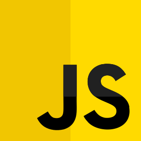
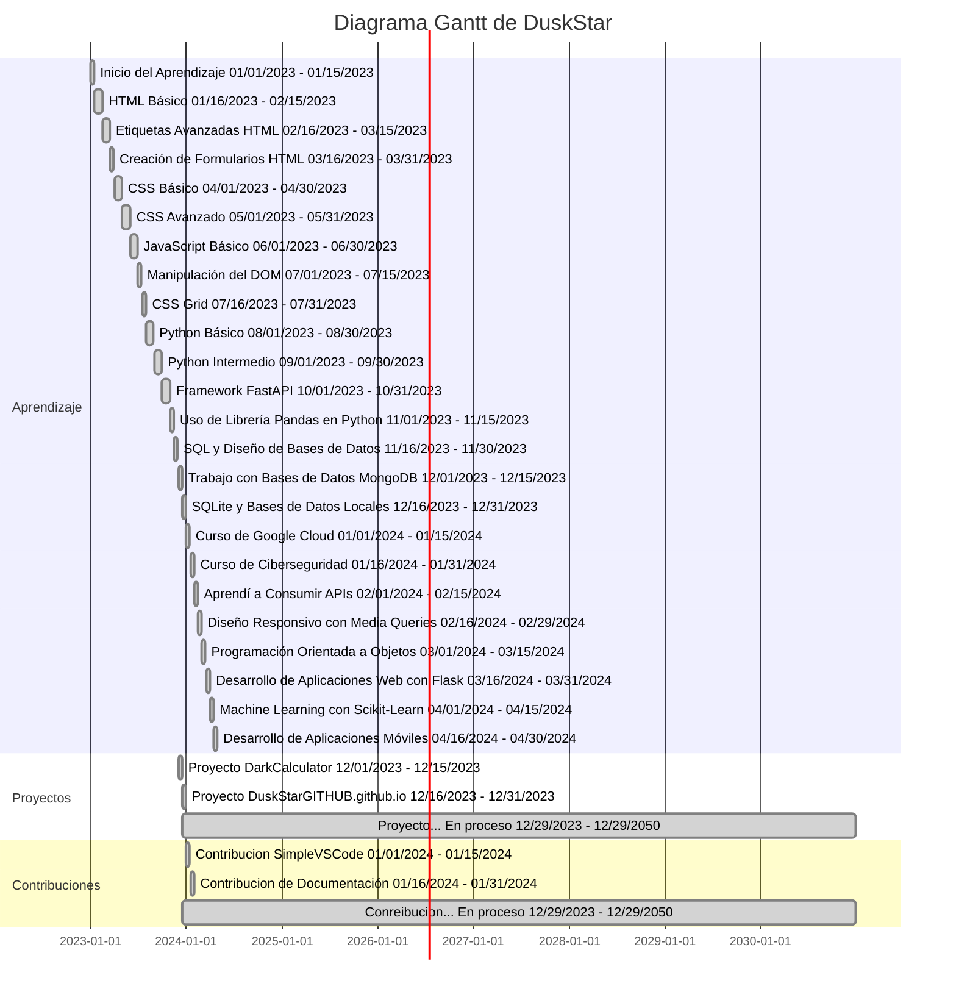

<picture>

</picture>
<h2><picture></picture><br>&nbsp;&nbsp;ACERCA DE MI</h2>
<br>
<h3>
  &nbsp;&nbsp;&nbsp;&nbsp;&nbsp;&nbsp;&nbsp;&nbsp;&nbsp;&nbsp;💻 Licenciado de informatica.<br>
  &nbsp;&nbsp;&nbsp;&nbsp;&nbsp;&nbsp;&nbsp;&nbsp;&nbsp;&nbsp;👨‍💻 Programador back-end.<br>
  &nbsp;&nbsp;&nbsp;&nbsp;&nbsp;&nbsp;&nbsp;&nbsp;&nbsp;&nbsp;🔍 Resolucion de problemas.<br>
  &nbsp;&nbsp;&nbsp;&nbsp;&nbsp;&nbsp;&nbsp;&nbsp;&nbsp;&nbsp;🛠️ Automatizacion de tareas.<br>
  &nbsp;&nbsp;&nbsp;&nbsp;&nbsp;&nbsp;&nbsp;&nbsp;&nbsp;&nbsp;📈 Constante.
</h3>
<br>
<h2><picture></picture><br>HABILIDADES</h2>
<br>
<br>
<div>
  <table><tr><td valign="center" width="33%">
    <a href="https://en.wikipedia.org/wiki/HTML5" target="_blank"></a>
    <a href="https://www.w3schools.com/css/" target="_blank"></a>
    <a href="https://www.typescriptlang.org/" target="_blank"></a>
    <a href="https://developer.mozilla.org/es/docs/Web/JavaScript" target="_blank"></a>
    <a href="https://www.python.org/" target="_blank"></a>
    <a href="https://www.cplusplus.com/" target="_blank"></a>
  </td><td valign="center" width="33%">
    <a href="https://www.mysql.com/" target="_blank"></a>
    <a href="https://www.mongodb.com/" target="_blank"></a>
    <a href="https://git-scm.com/" target="_blank"></a>
    <a href="https://www.docker.com/" target="_blank"></a>
    <a href="https://learn.microsoft.com/en-us/powershell/" target="_blank"></a>
    <a href="https://code.visualstudio.com/" target="_blank"></a>
  </td></tr></table>
</div>

<br>

<h2><picture></picture><br>&nbsp;&nbsp;ESTADISTICAS</h2>
<br>
<br>
<div align="center">
  
  
</div>

<h2><picture></picture><br>&nbsp;&nbsp;Mas...</h2>

<details>
<summary>
	🎓Recorrido
</summary>

<div align="center">
	


---

</div>
</details>

<details>
<summary>
    💬Frases sobre Programación
</summary>
<br>
    > "Programar es un arte que requiere de paciencia y creatividad."<br><br>
    > "La programación es el lenguaje del futuro, y cada programador es un escritor de si mismo."<br><br>
    > "El código bien escrito es la mejor documentación."<br><br>
    > "Programar es como resolver un rompecabezas en constante evolución."<br><br>
    > "En el mundo de la programación, cada error es una oportunidad de aprendizaje."<br><br>
</details>

<details>
<summary>
    🚀Proyectos
</summary><br>
<table align="center">
  <thead align="center">
    <tr border: none;>
      <td><b>📂 Nombres</b></td>
      <td><b>⭐ Estrellas</b></td>
      <td><b>📚 Forks</b></td>
      <td><b>🛎 Issues</b></td>
      <td><b>📬 Pull requests</b></td>
    </tr>
  </thead>
  <tbody>
<tr>
      <td><a href="https://github.com/DuskStarGITHUB/DuskStarGITHUB"><b>README</b></a></td>
      <td></td>
      <td></td>
      <td></td>
      <td></td>
    </tr>
    <tr>
      <td><a href="https://github.com/DuskStarGITHUB/PORTAFOLIO-GITHUB"><b>Portafolio GITHUB</b></a></td>
      <td></td>
      <td></td>
      <td></td>
      <td></td>
    </tr>
<tr>
      <td><a href="https://github.com/DuskStarGITHUB/DuskStarGITHUB.github.io"><b>Portafolio</b></a></td>
      <td></td>
      <td></td>
      <td></td>
      <td></td>
    </tr>
<tr>
      <td><a href="https://github.com/DuskStarGITHUB/DarkCalculator"><b>DarkCalculator</b></a></td>
      <td></td>
      <td></td>
      <td></td>
      <td></td>
    </tr>
<tr>
      <td><a href="https://github.com/DuskStarGITHUB/"><b>...</b></a></td>
      <td></td>
      <td></td>
      <td></td>
      <td></td>
    </tr>
  </tbody>
</table>
<br>
</details>

<details>
<summary>
    🤝Contribuciones
</summary><br>
<table align="center">
  <thead align="center">
    <tr border: none;>
      <td><b>📂 Nombres</b></td>
      <td><b>⭐ Estrellas</b></td>
      <td><b>📚 Forks</b></td>
      <td><b>🛎 Issues</b></td>
      <td><b>📬 Pull requests</b></td>
    </tr>
  </thead>
  <tbody>
<tr>
      <td><a href="https://github.com/n4-no/Simple-VS-Code"><b>Simple VS Code</b></a></td>
      <td></td>
      <td></td>
      <td></td>
      <td></td>
    </tr>
<tr>
      <td><a href="https://github.com/DuskStarGITHUB/"><b>...</b></a></td>
      <td></td>
      <td></td>
      <td></td>
      <td></td>
    </tr>
  </tbody>
</table>
<br>
</details>

<details><summary>🎒 Educacion</summary>
	
<div align="center">
  <h2><picture></picture> Experiencia</h2>
<br>
  <table>
    <tr>
      <td width="50%">
        <h3>🏫 Preparatoria</h3>
        COBAEM 18 Ixtapaluca, Bachillerato en Contabilidad
        - Clasificación de entidades económicas.
        - Registros contables.
        - Elaboración de estados financieros.
        - Cálculo de costos.
        - Nómina y contribuciones.
        - Desarrollo del plan de negocios.
      </td>
      <td width="50%">
        <h3>🏢 Universidad</h3>
        Estudiante de Licenciatura en Informática en ETAC Chalco
        - Enfoque en programación y desarrollo de software.
        - Conocimientos en bases de datos y seguridad informática.
        - Habilidades para resolver problemas.
        - Trabajo en proyectos tecnológicos innovadores.
        - Apasionado por la tecnología y el aprendizaje continuo.
      </td>
    </tr>
  </table>
</div>

<br>

<div align="center">
<h2>
 <picture></picture> Todo lo que desarolle para aprender
</h2>
<br>
  <p align="center">
    <a href="https://github.com/DuskStarGITHUB/PORTAFOLIO-GITHUB"></a>
</p>
</div>
</details>

<details><summary>📜 Credenciales</summary><br>
<div align="center">
	<table>
    <tr>
      <td></td>
      <td></td>
    </tr>
    <tr>
      <td></td>
      <td></td>
    </tr>
  </table>
</div>
</details>
<details><summary>🏆 Trofeos</summary><br>
<picture align="left">
 

</picture>
</details>

<div align="center">

	
  ```diff
  ─▄▀─▄▀
  ──▀──▀
  █▀▀▀▀▀█▄
  █░░░░░█─█
  ▀▄▄▄▄▄▀▀
  ```
</div>

