<picture>
	
</picture>
<h2><picture></picture><br>&nbsp;&nbsp;ACERCA DE MI</h2>
<h3>
	&nbsp;&nbsp;&nbsp;&nbsp;&nbsp;&nbsp;&nbsp;&nbsp;&nbsp;&nbsp;&nbsp;&nbsp;&nbsp;&nbsp;&nbsp;&nbsp;&nbsp;&nbsp;💻 Licenciado de informatica.<br>
  	&nbsp;&nbsp;&nbsp;&nbsp;&nbsp;&nbsp;&nbsp;&nbsp;&nbsp;&nbsp;&nbsp;&nbsp;&nbsp;&nbsp;&nbsp;&nbsp;&nbsp;&nbsp;👨‍💻 Programador back-end.<br>
  	&nbsp;&nbsp;&nbsp;&nbsp;&nbsp;&nbsp;&nbsp;&nbsp;&nbsp;&nbsp;&nbsp;&nbsp;&nbsp;&nbsp;&nbsp;&nbsp;&nbsp;&nbsp;🔍 Resolucion de problemas.<br>
  	&nbsp;&nbsp;&nbsp;&nbsp;&nbsp;&nbsp;&nbsp;&nbsp;&nbsp;&nbsp;&nbsp;&nbsp;&nbsp;&nbsp;&nbsp;&nbsp;&nbsp;&nbsp;🛠️ Automatizacion de tareas.<br>
  	&nbsp;&nbsp;&nbsp;&nbsp;&nbsp;&nbsp;&nbsp;&nbsp;&nbsp;&nbsp;&nbsp;&nbsp;&nbsp;&nbsp;&nbsp;&nbsp;&nbsp;&nbsp;📈 Constante.
</h3>
<h2><picture></picture><br>HABILIDADES</h2>
<div align="center">
	<table>
		<tr>
			<td>Front End</td>
			<td>Backend</td>
    			<td>BD</td>
    			<td>Dev</td>
    			<td>Dev Ops</td>
    			<td>Tools</td>
  		</tr>
		<tr>
			<td>
				
				
			</td>
			<td>
				
				
			</td>
			<td>
				
				
			</td>
			<td>
				
			</td>
			<td>
				
				
			</td>
			<td>
				
				
			</td>
		</tr>
		<tr>
			<td></td>
			<td>
				
				
			</td>
			<td>
				
			</td>
			<td>
				
				
			</td>
			<td>
				
				
			</td>
			<td>
				
				
			</td>
		</tr>
		<tr>
			<td></td>
			<td></td>
			<td></td>
			<td>
				
				
			</td>
			<td></td>
			<td></td>
		</tr>
		<tr>
			<td></td>
			<td></td>
			<td></td>
			<td>
				
				
			</td>
			<td></td>
			<td></td>
		</tr>
	</table>
</div>
<h2><picture></picture><br>&nbsp;&nbsp;ESTADISTICAS</h2>
<div align="center">
	
	
</div>

<h2><picture></picture><br>&nbsp;&nbsp;Mas...</h2>

<details>
	<summary>
		🎓Recorrido

```mermaid
gantt
	dateFormat MM/DD/YYYY
	title Diagrama Gantt de DuskStar

	section Aprendizaje
		Inicio del Aprendizaje 01/01/2023 - 01/15/2023 :done, start1, 01/01/2023, 01/15/2023
        	HTML Básico 01/16/2023 - 02/15/2023 :done, html1, 01/16/2023, 02/15/2023
        	Etiquetas Avanzadas HTML 02/16/2023 - 03/15/2023 :done, html2, 02/16/2023, 03/15/2023
        	Creación de Formularios HTML 03/16/2023 - 03/31/2023 :done, html3, 03/16/2023, 03/31/2023
        	CSS Básico 04/01/2023 - 04/30/2023 :done, css1, 04/01/2023, 04/30/2023
        	CSS Avanzado 05/01/2023 - 05/31/2023 :done, css2, 05/01/2023, 05/31/2023
        	JavaScript Básico 06/01/2023 - 06/30/2023 :done, js1, 06/01/2023, 06/30/2023
        	Manipulación del DOM 07/01/2023 - 07/15/2023 :done, js2, 07/01/2023, 07/15/2023
        	CSS Grid 07/16/2023 - 07/31/2023 :done, css3, 07/16/2023, 07/31/2023
        	Python Básico 08/01/2023 - 08/30/2023 :done, python1, 08/01/2023, 08/30/2023
        	Python Intermedio 09/01/2023 - 09/30/2023 :done, python2, 09/01/2023, 09/30/2023
        	Framework FastAPI 10/01/2023 - 10/31/2023 :done, fastapi1, 10/01/2023, 10/31/2023
        	Uso de Librería Pandas en Python 11/01/2023 - 11/15/2023 :done, python3, 11/01/2023, 11/15/2023
        	SQL y Diseño de Bases de Datos 11/16/2023 - 11/30/2023 :done, sql1, 11/16/2023, 11/30/2023
        	Trabajo con Bases de Datos MongoDB 12/01/2023 - 12/15/2023 :done, mongodb1, 12/01/2023, 12/15/2023
        	SQLite y Bases de Datos Locales 12/16/2023 - 12/31/2023 :done, sqlite1, 12/16/2023, 12/31/2023
        	Curso de Google Cloud 01/01/2024 - 01/15/2024 :done, cloud1, 01/01/2024, 01/15/2024
        	Curso de Ciberseguridad 01/16/2024 - 01/31/2024 :done, cibersec1, 01/16/2024, 01/31/2024
        	Aprendí a Consumir APIs 02/01/2024 - 02/15/2024 :done, api1, 02/01/2024, 02/15/2024
		Diseño Responsivo con Media Queries 02/16/2024 - 02/29/2024 :done, media1, 02/16/2024, 02/29/2024
        	Programación Orientada a Objetos 03/01/2024 - 03/15/2024 :done, oop1, 03/01/2024, 03/15/2024
		Desarrollo de Aplicaciones Web con Flask 03/16/2024 - 03/31/2024 :done, flask1, 03/16/2024, 03/31/2024
        	Machine Learning con Scikit-Learn 04/01/2024 - 04/15/2024 :done, ml1, 04/01/2024, 04/15/2024
        	Desarrollo de Aplicaciones Móviles 04/16/2024 - 04/30/2024 :done, mobile1, 04/16/2024, 04/30/2024

	section Proyectos
		Proyecto DarkCalculator 12/01/2023 - 12/15/2023 :done, proyecto1, 12/01/2023, 12/15/2023
		Proyecto DuskStarGITHUB.github.io 12/16/2023 - 12/31/2023 :done, proyecto2, 12/16/2023, 12/31/2023

	section Contribuciones
		Contribucion SimpleVSCode 01/01/2024 - 01/15/2024 :done, contribucion1, 01/01/2024, 01/15/2024
		Contribucion de Documentación 01/16/2024 - 01/31/2024 :done, contribucion2, 01/16/2024, 01/31/2024

```

	</summary>
	<div align="center">
	


---

</div>
</details>

<details>
	<summary>
		💬Frases sobre Programación
	</summary>
	<br>
	> "Programar es un arte que requiere de paciencia y creatividad."<br><br>
	> "La programación es el lenguaje del futuro, y cada programador es un escritor de si mismo."<br><br>
	> "El código bien escrito es la mejor documentación."<br><br>
	> "Programar es como resolver un rompecabezas en constante evolución."<br><br>
	> "En el mundo de la programación, cada error es una oportunidad de aprendizaje."<br><br>
</details>

<details>
	<summary>
		🚀Proyectos
	</summary>
	<br>
	<table align="center">
		<thead align="center">
			<tr border: none;>
				<td>
					<b>
						📂 Nombres
					</b>
				</td>
				<td>
					<b>
						⭐ Estrellas
					</b>
				</td>
				<td>
					<b>
						📚 Forks
					</b>
				</td>
				<td>
					<b>
						🛎 Issues
					</b>
				</td>
				<td>
					<b>
						📬 Pull requests
					</b>
				</td>
			</tr>
		</thead>
		<tbody>
			<tr>
				<td>
					<a href="https://github.com/DuskStarGITHUB/DuskStarGITHUB">
						<b>
							README
						</b>
					</a>
				</td>
				<td>
					
				<td>
					
				<td>
					
				<td>
					
				</td>
			</tr>
			<tr>
				<td>
					<a href="https://github.com/DuskStarGITHUB/PORTAFOLIO-GITHUB">
						<b>
							Portafolio GITHUB
						</b>
					</a>
				</td>
				<td>
					
				<td>
					
				</td>
				<td>
					
				</td>
				<td>
					
				</td>
			</tr>
			<tr>
				<td>
					<a href="https://github.com/DuskStarGITHUB/DuskStarGITHUB.github.io">
						<b>
							Portafolio
						</b>
					</a>
				</td>
				<td>
					
				</td>
				<td>
					
				</td>
				<td>
					
				</td>
				<td>
					
				</td>
			</tr>
			<tr>
				<td>
					<a href="https://github.com/DuskStarGITHUB/DarkCalculator">
						<b>
							DarkCalculator
						</b>
					</a>
				</td>
				<td>
					
				<td>
					
				</td>
				<td>
					
				</td>
				<td>
					
				</td>
			</tr>
			<tr>
				<td>
					<a href="https://github.com/DuskStarGITHUB/">
						<b>
							...
						</b>
					</a>
				</td>
				<td>
					
				</td>
				<td>
					
				</td>
				<td>
					
				</td>
				<td>
					
				</td>
			</tr>
		</tbody>
	</table>
</details>

<details>
	<summary>
		🤝Contribuciones
	</summary>
	<br>
	<table align="center">
		<thead align="center">
			<tr border: none;>
				<td>
					<b>
						📂 Nombres
					</b>
				</td>
				<td>
					<b>
						⭐ Estrellas
					</b>
				</td>
				<td>
					<b>
						📚 Forks
					</b>
				</td>
				<td>
					<b>
						🛎 Issues
					</b>
				</td>
				<td>
					<b>
						📬 Pull requests
					</b>
				</td>
			</tr>
		</thead>
		<tbody>
			<tr>
				<td>
					<a href="https://github.com/n4-no/Simple-VS-Code">
						<b>
							Simple VS Code
						</b>
					</a>
				</td>
				<td>
					
				</td>
				<td>
					
				</td>
				<td>
					
				</td>
				<td>
					
				</td>
			</tr>
			<tr>
				<td>
					<a href="https://github.com/DuskStarGITHUB/">
						<b>
							...
						</b>
					</a>
				</td>
				<td>
					
				</td>
				<td>
					
				</td>
				<td>
					
				</td>
				<td>
					
				</td>
			</tr>
		</tbody>
	</table>
</details>

<details>
	<summary>
		🎒 Educacion
	</summary>
	<div align="center">
		<h2>
			<picture>
				
			</picture>
			Experiencia
		</h2>
		<br>
<table>
	<tr>
		<td width="50%"><h3>🏫 Preparatoria</h3><br>
			Estudié Contabilidad en COBAEM 18 Ixtapaluca, adquiriendo conocimientos en clasificación de entidades económicas, registros contables, estados financieros, cálculo de costos, nómina y contribuciones, además de desarrollar un plan de negocios todo desde una manera basica y permitido tras el plan de estudios.
		</td>
		<td width="50%"> <h3>🏛️ Universidad</h3><br>
			Estudié Informática en ETAC Chalco, adquiriendo conocimientos en programación, desarrollo de software, bases de datos y seguridad informática. También poseo habilidades para resolver problemas y participo en proyectos tecnológicos innovadores. Siempre me apasiona la tecnología y el aprendizaje continuo.
		</td>
	</tr>
</table>
	</div>
	<div align="center">
		<h2>
			<picture>
				
			</picture>
			Todo lo que desarolle para aprender
			
		</h2>
		<br>
		<p align="center">
			<a href="https://github.com/DuskStarGITHUB/PORTAFOLIO-GITHUB">
				
			</a>
		</p>
	</div>
</details>

<details>
	<summary>
		📜 Credenciales
	</summary>
	<br>
	<div align="center">
		<table>
			<tr>
				<td>
					
				</td>
				<td>
					
				</td>
			</tr>
			<tr>
				<td>
				</td>
				<td>
					
				</td>
			</tr>
		</table>
	</div>
</details>
<details>
	<summary>
		🏆 Trofeos
	</summary>
	<br>
<picture align="left">
	

</picture>
</details>
<div align="center">
	
```diff
 ─▄▀─▄▀
 ──▀──▀
 █▀▀▀▀▀█▄
 █░░░░░█─█
 ▀▄▄▄▄▄▀▀

 ```

</div>

