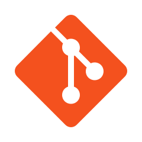

<br>
<div align="center">
  
  # <h1>**GITHUB**</h1>
</div>


<br>
<br>
<br>

<h1 align="center">| Informacion |</h1>

<br>
<br>

<h2><picture></picture><br>&nbsp;&nbsp;ACERCA DE MI</h2>
<br>
<h3>
  &nbsp;&nbsp;&nbsp;&nbsp;&nbsp;&nbsp;&nbsp;&nbsp;&nbsp;&nbsp;💻 Licenciado de informatica.<br>
  &nbsp;&nbsp;&nbsp;&nbsp;&nbsp;&nbsp;&nbsp;&nbsp;&nbsp;&nbsp;👨‍💻 Programador back-end.<br>
  &nbsp;&nbsp;&nbsp;&nbsp;&nbsp;&nbsp;&nbsp;&nbsp;&nbsp;&nbsp;🔍 Resolucion de problemas.<br>
  &nbsp;&nbsp;&nbsp;&nbsp;&nbsp;&nbsp;&nbsp;&nbsp;&nbsp;&nbsp;🛠️ Automatizacion de tareas.<br>
  &nbsp;&nbsp;&nbsp;&nbsp;&nbsp;&nbsp;&nbsp;&nbsp;&nbsp;&nbsp;📈 Constante.
</h3>
<br>
<h2><picture></picture><br>HABILIDADES</h2>
<br>
<br>
<div>
  <table><tr><td valign="center" width="33%">
    <a href="https://en.wikipedia.org/wiki/HTML5" target="_blank"></a>
    <a href="https://www.w3schools.com/css/" target="_blank"></a>
    <a href="https://www.typescriptlang.org/" target="_blank"></a>
    <a href="https://developer.mozilla.org/es/docs/Web/JavaScript" target="_blank"></a>
    <a href="https://www.python.org/" target="_blank"></a>
    <a href="https://www.cplusplus.com/" target="_blank"></a>
  </td><td valign="center" width="33%">
    <a href="https://www.mysql.com/" target="_blank"></a>
    <a href="https://www.mongodb.com/" target="_blank"></a>
    <a href="https://git-scm.com/" target="_blank"></a>
    <a href="https://www.docker.com/" target="_blank"></a>
    <a href="https://learn.microsoft.com/en-us/powershell/" target="_blank"></a>
    <a href="https://code.visualstudio.com/" target="_blank"></a>
  </td></tr></table>
</div>

<br>

<h2><picture></picture><br>&nbsp;&nbsp;ESTADISTICAS</h2>
<br>
<br>
<div align="center">
  
  
</div>

	
<h2><picture></picture><br>&nbsp;&nbsp;Mas...</h2>

<details>
<summary>
	🎓Recorrido
</summary>

<div align="center">
	


---

</div>
</details>

<details>
<summary>
    💬Frases sobre Programación
</summary>
    > "Programar es un arte que requiere de paciencia y creatividad."<br>
    > "La programación es el lenguaje del futuro, y cada programador es un escritor de si mismo."<br>
    > "El código bien escrito es la mejor documentación."<br>
    > "Programar es como resolver un rompecabezas en constante evolución."<br>
    > "En el mundo de la programación, cada error es una oportunidad de aprendizaje."<br>
</details>

<details>
<summary>
    🚀Proyectos
</summary>
1- [DarkCalculator](https://github.com/DuskStarGITHUB/DarkCalculator)<br>
	-Desarolle mi propia app.
</details>

<details>
<summary>
    🤝Contribuciones
</summary>
1- [Simple VS Code](https://github.com/n4-no/Simple-VS-Code)<br>
	-Le enseñe herramientas y funciones de github.
</details>

<div align="center">
	
  ```diff
  ─▄▀─▄▀
  ──▀──▀
  █▀▀▀▀▀█▄
  █░░░░░█─█
  ▀▄▄▄▄▄▀▀
  ```
</div>

